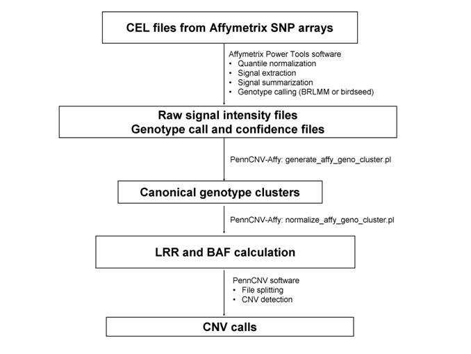

## Affymetrix CNV calling overview

The procedure below outlines how to process raw CEL files and generates canonical genotype clusters, then convert signal intensity for each sample to LRR/BAF values, then generates CNV calls. For this protocol to work, one need to use at least 100 CEL files to generate a reasonably good clustering file. If the user has only a few CEL files, then it is necessary to use the default canonical clustering file in the PennCNV-Affy package, but in this case the CNV calls may not be reliable.



## Step 1. Generate the signal intensity data based on raw CEL files

The goal of the first step is to generate the cross-marker normalized signal intensity data from an Affymetrix genotyping project to a text file, so that it can be analyzed subsequently by the PennCNV software. This step has 3 substeps.

Suppose all the files from a genotyping project is stored in a directory called gw6/. Under this directory, there are several sub-directories: a CEL/ directory that stores the raw CEL files for each genotyped sample, a lib/ directory that stores library and annotation files provided by Affymetrix and by PennCNV-Affy,. We will try to write output files to the apt/ directory.

We need to download the PennCNV software and uncompress the file. Next download the [PennCNV-Affy programs and library files](http://www.openbioinformatics.org/penncnv/download/gw6.tar.gz) and uncompress the file. These files are required for signal pre-processing and also for CNV calling. There will be a `lib/` directory that contains some PennCNV-specific library files for genome-wide 6.0 array; in addition, the library files for the genome-wide 5.0 arrays and Mapping 500K arrays are in the `libgw5/` and `gw6/`, `lib500k/` directories, respectively.

Next download the Affymetrix Power Tools (APT) software package from http://www.affymetrix.com/support/developer/powertools/index.affx. We need to log into the website to download the software (the registration is free).

### - Substep 1.1 Generate genotyping calls from CEL files

This step uses the apt-probeset-genotype program in Affymetrix Power Tools (APT) to generate genotyping calls from the raw CEL files using the Birdseed algorithm (for genome-wide 6.0 array) or BRLMM-P (for genome-wide 5.0 array) algorithm. Note that the genotyping calling requires lots of CEL files.

**Genome-wide 6.0 array**

Before performing this step, we need to download the library files for the genome-wide 6.0 array from http://www.affymetrix.com/Auth/support/downloads/library_files/genomewidesnp6_libraryfile.zip, and save the decompressed files to the lib/ directory. Several files in this directory, including a CDF file and a Birdseed model file, will be used in the genotype calling step.

```
[kai@cc ~/]$ apt-probeset-genotype -c lib/GenomeWideSNP_6.cdf -a birdseed --read-models-birdseed lib/GenomeWideSNP_6.birdseed.models --special-snps lib/GenomeWideSNP_6.specialSNPs --out-dir apt --cel-files listfile
```

The above command generates genotyping calls using all CEL files specified in the listfile, and generates several output files in the apt/ directory. The listfile contains a list of CEL file names, with one name per line, and with the first line being cel_files. The output files for this command include birdseed.confidences.txt, birdseed.report.txt and birdseed.calls.txt. In addition, a birdseed.report.txt file is generated, that will be helpful to infer sample gender to generate a sexfile (see Substep 1.3 below).

For a typical modern computer, the command should take less than one day for 1000-2000 CEL files. The command should usually work well by the default parameters set by APT program.

> Note: In the latest version of APT, Affy changed the default behavior of memory usage: by default, all data (without being divided into blocks) are written to a temporary file (as virtual memory) and then the temporary file is analyzed. This makes the program extremely slow (use "top" command to see the CPU usage of the program) but it can accormodate large data sets with many thousands of samples. (If a user is not satisfied with this behavior, the --user-disk argument can be set as false to enable the block-size based analysis.) When analyzing many thousand Affy 500K arrays, the default method may not work, since the "prior model" may take forever to build (this is not an issue for GW5 or GW6 array since the BRLMMP/BIRDSEED model is already provided in command line). If this is the case for the user, try to analyze only 500 samples and write the prior to a file (via --write-prior argument), then reanalyze the entire sample using --read-priors-brlmm argument to expedite the process.

> Note: If the program complains about Wrong CEL ChipType, for example, with error message "expecting: 'GenomeWideSNP_6' and inputfile.CEL is: 'GenomeWideEx_6'". Then simply add "--chip-type GenomeWideEx_6 --chip-type GenomeWideSNP_6" to the command line to solve the problem.

**Genome-wide 5.0 array**

For genome-wide 5.0 arrays, the command line is slightly different. First download the CDF and model files for GW5 array from http://www.affymetrix.com/Auth/support/downloads/library_files/genomewidesnp5_libraryfile_rev1.zip and http://www.affymetrix.com/Auth/support/downloads/library_files/GenomeWideSNP_5.r2.zip. Then save decompressed files to the lib/ directory.  There are several CDF files but we will need to use the GenomeWideSNP_5.Full.r2.cdf file. The genotype calling can be done using a command like this:

```
[kai@cc ~/]$ apt-probeset-genotype -c lib/GenomeWideSNP_5.Full.r2.cdf --chrX-snps lib/GenomeWideSNP_5.Full.chrx --read-models-brlmmp lib/GenomeWideSNP_5.models -a brlmm-p --out-dir apt --cel-files listfile
```

**Mapping 500K array**

For Mapping 500K array set with Nsp and Sty arrays, the genotype calling and signal extraction need to be done separately for each array. The command for genotype calling should use brlmm (instead of brlmm-p) as the algorithm (this is the default algorithm). In addition, there is no need to specify the --read-models-brlmmp argument as shown above for Affy 5.0 arrays.

```
[kai@cc ~/]$ apt-probeset-genotype -c lib/CD_Mapping250K_Nsp_rev4/Full/Mapping250K_Nsp/LibFiles/Mapping250K_Nsp.cdf --chrX-snps lib/affy500k/CD_Mapping250K_Nsp_rev4/Full/Mapping250K_Nsp/LibFiles/Mapping250K_Nsp.chrx --out-dir apt_nsp/ --cel-files list.nsp
```

As mentioned in the note above, if the program takes forever to run (during "computing prior" step), try to analyze only 500 samples and write the prior to a file (via --write-prior argument), then reanalyze the entire sample using --read-priors-brlmm argument to expedite the process.

**Mapping 100K array**

Follow the same procedure as 500K array, but download the specific cdf files from Affy (this one for Hind and this one for Xba). Some users have reported success running through 100K arrays. One example is given below.

```
[kaiwang@cc ~/]$ apt-probeset-genotype -c CD_Mapping50K_Xba240_rev3/Full/Mapping50K_Xba240/LibFiles/Mapping50K_Xba240.CDF --chrX-snps CD_Mapping50K_Xba240_rev3/Full/Mapping50K_Xba240/LibFiles/Mapping50K_Xba240.chrx --out-dir apt_xba *.CEL
```

**Axiom array**

The instructions below were provided by Professor George Kirov at Cardiff University.

Using APT: `apt-probeset-genotype --analysis-files-path Axiom_UKB_WCSG.xml --out-dir Batch1 --summaries --cel-files list_CEL_files.txt` (The user has to choose the appropriate `Axiom_UKB_WCSG.xml` file that suits their analysis). Follow instructions provided by APT.

The command generates 4 output files:
* AxiomGT1.calls.txt
* AxiomGT1.confidences.txt (contains confidences for the genotype calls).
* AxiomGT1.report.txt (contains various summaries for the samples analyzed, including the computed gender, call rate and heterozygosity).
* AxiomGT1.summary.txt

The manuscript reporting the above procedure has been published [here](http://www.sciencedirect.com/science/article/pii/S0006322316327111). Detailed procedure for CNV calling on the Axiom array can be found in the supplementary materials in the published manuscript.

**Cytoscan HD array**

You can just use the “affy2sv" R wrapper around the APT tools for CNV calling. The instructions below were provided by Venkata Teja Yellapantula at Memorial Sloan Kettering Cancer Center.

```
library(affy2sv)
setwd("/ifs/res/leukgen/home/yellapav/SNPArray/p292")
aptParam <- APTparam(
    type="cytoscan", 
    level="standard",
    cel.list="/ifs/res/leukgen/home/yellapav/SNPArray/p292/MM_NGS_CEL_Files/", 
    output.path="/ifs/res/leukgen/home/yellapav/SNPArray/p292/affy2sv_out", 
    analysis.path="/ifs/res/leukgen/home/yellapav/SNPArray/cytoscan/a32.3",
    cdf="CytoScanHD_Array.cdf", 
    chrX="CytoScanHD_Array.chrXprobes", 
    chrY="CytoScanHD_Array.chrYprobes", 
    qca="CytoScanHD_Array.r1.qca", 
    qcc="CytoScanHD_Array.r1.qcc", 
    snp="CytoScanHD_Array.snplist.txt", 
    annot.db="CytoScanHD_Array.na32.3.annot.db", 
    refmodel="CytoScanHD_Array.na32.3.v1.REF_MODEL"
)

Cyto2APT(aptParam)

Cyto2Mad(
    cychp.files="/ifs/res/leukgen/home/yellapav/SNPArray/p292/affy2sv_out",
    output.name="cychd",
    output.type="penncnv",
    annotation.file="/ifs/res/leukgen/home/yellapav/SNPArray/cytoscan/CytoScanHD_Array.na33.annot.csv"
)

Cyto2Mad(
    cychp.files="/ifs/res/leukgen/home/yellapav/SNPArray/p292/affy2sv_out",
    output.name="cychd.mad",
    output.type="mad",
    annotation.file="/ifs/res/leukgen/home/yellapav/SNPArray/cytoscan/CytoScanHD_Array.na33.annot.csv"
)

smc <- Cyto2SnpMatrix(
    cychp.files="/ifs/res/leukgen/home/yellapav/SNPArray/p292/affy2sv_out",
    annotation.file="/ifs/res/leukgen/home/yellapav/SNPArray/cytoscan/CytoScanHD_Array.na33.annot.csv",
    output.type="snpmatrix"
)

Cyto2SnpMatrix(
    cychp.files="/ifs/res/leukgen/home/yellapav/SNPArray/p292/affy2sv_out",
    annotation.file="/ifs/res/leukgen/home/yellapav/SNPArray/cytoscan/CytoScanHD_Array.na33.annot.csv",
    output.name="cychd.plink",
    output.type="plink",
)
```


### - Subsetp 1.2 Allele-specific signal extraction from CEL files

This step uses the Affymetrix Power Tools software to extract allele-specific signal values from the raw CEL files. Here `allele-specific` refers to the fact that for each SNP, we have a signal measure for the A allele and a separate signal measure for the B allele.

**Genome-wide 6.0 array**

An example command is given below:

```
[kai@cc ~/]$ apt-probeset-summarize --cdf-file lib/GenomeWideSNP_6.cdf --analysis quant-norm.sketch=50000,pm-only,med-polish,expr.genotype=true --target-sketch lib/hapmap.quant-norm.normalization-target.txt --out-dir apt --cel-files listfile
```

The above command read signal intensity values for PM probes in all the CEL files specified in listfile, apply quantile normalization to the values, apply median polish on the data, then generates signal intensity values for A and B allele for each SNP. The file hapmap.quant-norm.normalization-target.txt is provided in the PennCNV-Affy package: it is generated using all HapMap samples, as a reference quantile distribution to use in the normalization process, so that the quantile normalization procedures for different genotyping projects are more comparable to each other.

**Genome-wide 5.0 array**

For genome-wide 5.0 arrays, the target-sketch can be found in the libgw5/ directory. An example command is given below:

```
[kai@cc ~/]$ apt-probeset-summarize --cdf-file lib/GenomeWideSNP_5.Full.r2.cdf --analysis quant-norm.sketch=50000,pm-only,med-polish,expr.genotype=true --target-sketch libgw5/agre.quant-norm.normalization-target.txt --out-dir apt --cel-files listfile
```

**Mapping 500K array**

The signal extraction needs to be done for each array type separately. The pm-only option need to be used in --analysis argument since Mapping 500K array contains both PM and MM probes for each probe set.

```
[kai@cc ~/]$ apt-probeset-summarize --cdf-file lib/affy500k/CD_Mapping250K_Nsp_rev4/Full/Mapping250K_Nsp/LibFiles/Mapping250K_Nsp.cdf --out-dir apt_nsp/ --cel-files list.nsp -a quant-norm.sketch=50000,pm-only,med-polish,expr.genotype=true --target-sketch lib/hapmap.nsp.quant-norm.normalization-target.txt
```

**Mapping 100K array**

The signal extraction needs to be done for each array type separately. An example is below:

```
[kaiwang@cc ~/]$ apt-probeset-summarize --cdf-file CD_Mapping50K_Xba240_rev3/Full/Mapping50K_Xba240/LibFiles/Mapping50K_Xba240.CDF --out-dir apt_xba/ -a quant-norm.sketch=50000,pm-only,med-polish,expr.genotype=true *.CEL
```

A note on normalization target: the `--target-sketch` argument above gives a reference signal distribution, such that a new array can be normalized using the percentiles in the reference distribution. It is useful and necessary if the user has only a few dozen CEL files, and wants to use the default clustering file provided in the PennCNV-Affy package.

For a typical modern computer, the command should take less than one day for 1000-2000 CEL files. Several output files will be generated in the apt/ directory, including `quant-norm.pm-only.med-polish.expr.summary.txt`, which contains the signal values (one allele per line, one sample per column). For SNP probes, two lines are used per probe, for A and B alleles, respectively. For non-polymorphic probes (so-called CN probes), only one line is used per probe. It is very important to check that the APT programs finish completely, before proceeding to next steps. Check the LOG files to see whether it reports a success.

### - Substep 1.3 Generate canonical genotype clustering file

This step generates a file that contains the parameters for the canonical clustering information for each SNP or CN marker, such that this file can be used later on to calculate LRR and BAF values.

If the user has only a few dozen CEL files, then it is unlikely that a clustering file can be generated successfully and accurately. In that case, one can skip this step and go to substep 1.4 directly, but using the default clustering file provided in PennCNV-Affy package (hapmap.genocluster for GW6 array, and agre.genocluster for GW5 array, hapmap.nsp/sty.genocluster for 500K array).

**Genome-wide 6.0 array**

To generate canonical genotype clusters, use the `generate_affy_geno_cluster.pl` program in the downloaded PennCNV-Affy package (see `gw6/bin/` directory).

```
[kai@cc ~/]$ generate_affy_geno_cluster.pl birdseed.calls.txt birdseed.confidences.txt quant-norm.pm-only.med-polish.expr.summary.txt -locfile ../lib/affygw6.hg18.pfb -sexfile file_sex -out gw6.genocluster
```

The `affygw6.hg18.pfb` file is provided in PennCNV-Affy package, which contains the annotated marker positions in hg18 (NCBI 36) human genome assembly. The `file_sex` file is a two-column file that annotates the sex information for each CEL file, one file per line, and each line contains the file name and the sex separated by tab. The file_sex file is important for chrX markers and chrY markers, such that only females are used for constructing canonical clusters for chrX markers and that only males are used for constructing canonical clusters for chrY markers. For example, the first 10 lines of a `file_sex` file is below:

```
10918.CEL       male
10924.CEL       male
11321_2.CEL     female
10998.CEL       female
11039.CEL       female
11345.CEL       female
10909.CEL       female
11035.CEL       female
11569_2.CEL     female
```

Alternatively, one can use 1 to specify male and 2 to specify female in the sexfile. If the sex information for some CEL file is not known, you do not need to include them in the sexfile.

Tip: the birdseed.report.txt file that was generated from Substep 1.1 above contains some information that might be helpful to construct the sexfile. Examine the report file and you'll find the columns such as "computed_gender" for each CEL file. A simple command, such as `fgrep male birdseed.report.txt | cut -f 1,2 > file_sex` can be used to generate the sexfile.

If the `--sexfile` argument is not provided, then chrX and chrY markers will not be processed and the resulting cluster file is only suitable for autosome CNV detection!

For a typical modern computer, the command should take several hours to process files generated from 1000-2000 CEL files.

**Genome-wide 5.0 array**

An example command is given below:

```
[kai@cc ~/ project/affycnv/gw5/apt]$ generate_affy_geno_cluster.pl brlmm-p.calls.txt brlmm-p.confidences.txt quant-norm.pm-only.med-polish.expr.summary.txt -locfile ../libgw5/affygw5.hg18.pfb -sexfile file_sex -out gw5.genocluster
```

**Mapping 500K array**

Similar command as genome-wide arrays should be used for Nsp and Sty array separately.

```
[kai@cc ~/]$ generate_affy_geno_cluster.pl ../apt_nsp/brlmm.calls.txt ../apt_nsp/brlmm.confidences.txt ../apt_nsp/quant-norm.pm-only.med-polish.expr.summary.txt -locfile lib/affy500k.hg18.pfb -sexfile file_sex -out nsp.genocluster
```

**Mapping 100K array**

Same as above. Get the PFB file here. It functions both as a --locfile in the command line above, and as a --pfbfile in CNV calling later on.


**Axiom array**

Next, use PennCNV-Affy: 

```
generate_affy_geno_cluster.pl AxiomGT1.calls.txt AxiomGT1.confidences.txt AxiomGT1.summary.txt --nopower2 -locfile mapfile.dat -sexfile sex_batch1.txt -out batch1.genocluster`
```

Please note the `-nopower2` argument above. The signal intensity values have not been log2 normalized, so the `-nopower2` argument is needed.

Then follow the PennCNV-Affy workflow. 

### - Substep 1.4 LRR and BAF calculation

This step use the allele-specific signal intensity measures generated from the last step to calculate the Log R Ratio (LRR) values and the B Allele Frequency (BAF) values for each marker in each individual. The `normalize_affy_geno_cluster.pl` program in the downloaded PennCNV-Affy package (see gw6/bin/ directory) is used:

```
[kai@cc ~/]$ normalize_affy_geno_cluster.pl gw6.genocluster quant-norm.pm-only.med-polish.expr.summary.txt -locfile ../lib/affygw6.hg18.pfb -out gw6.lrr_baf.txt
```

The above command generates LRR and BAF values using the summary file generated in last step, and using a cluster file called `gw6.genocluster` generated in the last step. The location file specifies the chromosome position of each SNP or CN probe, and this information is printed in the output files as well to facilitate future data processing.

For axiom array, this command is used:

```
normalize_affy_geno_cluster.pl batch1.genocluster AxiomGT1.summary.txt -nopower2 -locfile mapfileAX.dat -out batch1_lrr_baf.txt
```

Please note the `-nopower2` argument above. The signal intensity values have not been log2 normalized, so the `-nopower2` argument is needed.

If you see an error similar to " expect to read B allele after reading A allele for AFFX-NP-77285336-A, but instead read AFFX-NP-77285338-A" for Axiom array, it is because the marker AFFX-NP-77285336 is non-polymorphic marker and should not have been included in the genotype calls. You can manually grep out of all "AFFX-NP-" lines and the command above should then work.

For a typical modern computer, the command should take several hours to process files generated from 1000-2000 CEL files. A new tab-delimited file called gw6.lrr_baf.txt will be generated that contains one SNP per line and one sample per two columns (LRR column and BAF column).

If the user does not have sufficient number of CEL files for the above substep 1.1 and 1.3, then you can alternatively use the default canonical clustering file provided in the PennCNV-Affy package. Right now several files are provided: hapmap.genocluster for GW6 arrays, agre.genocluster for GW5 arrays, and `affy500k.nsp.genocluster/affy500k.sty.genocluster` for Mapping 500K arrays. The results won't be optimal and are probably highly unreliable (the QC measures during PennCNV calling can give some clue on the signal-to-noise ratio of the resulting signal intensity files).

## Step 2: Split the signal file into individual files for CNV calling by PennCNV

The first a few lines and first a few columns of the tab-delimited gw6.lrr_baf.txt file may look like this:

| Name	| Chr | Position | NA06985_GW6_C.CEL.Log R Ratio | NA06985_GW6_C.CEL.B Allele Freq | NA06991_GW6_C.CEL.Log R Ratio | NA06991_GW6_C.CEL.B Allele Freq |
| --- | --- | --- | --- | --- | --- | --- |
| SNP_A-2131660 | 1 | 1145994 | 0.0068 | 0.5156 | -0.3452 | 0.4954 |
| SNP_A-1967418 | 1 | 2224111 | 0.1564 | 0.9621 | -0.0146 | 1 |

The first line is referred to as the header line, which contains information on the meaning of each column. Each subsequent line contains information on one SNP per line for all individuals.

After this file is generated, we need to split this huge file into individual signal intensity files (one for each subject), then we can follow the procedures outlined in the PennCNV tutorial, and generate the CNV calls using a similar procedure as for Illumina arrays. The only difference is that the HMM file (gw6.hmm) and the PFB file (affygw6.hg18.pfb and affygw5.hg18.pfb) should be used for Affymetrix CNV calling. Several basic steps are briefly described below:

Use the kcolumn.pl program to split the gw6.lrr_baf.txt file, the split 2 argument should be used, since every two columns (Log R Ratio and B Allele Frequency) should be in each output file. An example is given below:

```
kcolumn.pl gw6.lrr_baf.txt split 2 -tab -head 3 -name -out gw6
```

Many files will be generated, each containing LRR/BAF values for one sample. The output file names are `gw6.NA06985_GW6_C`, `gw6.NA06991_GW6_C`, and so on (since the "-out gw6" argument is specified). Now generate a text file called signallistfile, which contains one signal file name per line, to be used by PennCNV. For example, first line is gw6.NA06985_GW6_C, second line is gw6.NA06991_GW6_C.

Tip: In the above command, if not using the --name argument, then the output file name will be something like gw6.split1, gw6.split2 and so on. The -name argument tells the program that the output file name should be based on the first word in the first line of the inputfile (for example, `NA06985_GW6_C` and `NA06991_GW6_C`). In addition, you can also add the `--beforestring _GW6` argument to the above command; this means that any string before the `_GW6` should be used as output file name, so that the output file names are `gw6.NA06985`, `gw6.NA06991` and so on. Similarly, if using `--beforestring .Log` argument, then the output file names are `gw6.NA06985_GW6_C.CEL`, `gw6.NA06991_GW6_C.CEL`, etc.

> Note: After file spliting, it is very important to check the output files. Normally, if you keep the terminal open, after the program finished, there should be a line saying that all splitting is done to confirm that this step is completely successfully. Sometimes due to lack of hard drive space, or due to an interruption of the program before it's finished, the file splitting is not completed successfully, resulting in fewer markers than it should contain. You can do a simple `wc -l file.split1` to check the number of lines in a random output file: it should be around 1.8 million for Affy 6, 800K for Affy 5, 500K for Mapping 550K arrays. If not, then the file splitting is not completely corrrectly and you can use `tail file.split1` to see what's the last line in the file, usually the line is not complete, meaning that something is wrong there. Re-do the splitting again, and make sure that the file splitting is completed before calling CNVs.

Finally generate the CNV calls. An example is given below:

```
detect_cnv.pl -test -hmm lib/affygw6.hmm -pfb lib/affygw6.hg18.pfb -list signallistfile -log gw6.log -out gw6.rawcnv
```

In the above command, the signallistfile is the file that contains all the signal file names, one per line. PennCNV will call CNV for each of them sequentially, for example, first generate CNV calls for `gw6.AN06985`, then for `gw6.NA06991`, etc. Alternatively, we can just specify a few signal file names in the command line without using the `-list` argument.

For the 500K array, one can concatentate the two subarrays together into one single file, then use PennCNV (for example `cat nsp.NA06985.txt sty.NA06985.txt > combined.NA06986.txt` to generate a combined file, then call CNV from the combined file (the extra header line in the middle of the combined file will be ignored by PennCNV).

Please check the "CNV calling" section in the left menu bar in the webpage for additional explanations to the output files and log files on the CNV calls.

## Additional topics

1. Number of CNV calls per individual

    Some people have complained that PennCNV-Affy generates too few CNV calls (typically with median of 30 calls per individual for GW5 array and 50 calls per individual for GW6 array), compared to other CNV detection algorithms. This will make things harder, if the user wants to analyze Affy data using two algorithms and take the overlap for follow-up. To get more sensitive CNV detection with the potential cost of more false positives, you can try to use the agre.hmm file included in the libgw5/ directory instead (this file typically doubles or even triples the number of calls compared to the default affygw6.hmm file).

2. QC thresholds

    Generally speaking, Affy data contains more noises than Illumina data, so a more liberal QC threshold (such as LRR_SD, etc) should be used for Affy data. Do not worry if you see warning messages on "not passing QC thresholds" for Affy samples, as these stringent thresholds were largely based on Illumina arrays.

3. Genotype calling: lump together or plate-by-plate?

    This is a hotly debated topic. When doing genotype calling or signal extraction for thousands of samples, should they be processed in the same batch in one run, or should they be processed plate-by-plate? Different people have different opinions. Generally speaking, for both APT and CLRMM, lumping all plates together has lower SNP call rates, compared to plate-by-plate method, but may have less chance of generating bad genotype clusters and getting spurious SNP association signals.

    My own recommendation is to analyze all plates all together in one run. After CNV calls are generated, you can very easily plot the QC measures (like WF values, LRR_SD values, numcalls per individual) for each plate: if there is a bad plate, then it is very easy to spot as it will be a clear outlier. In this case, just take this one or a few plates out and re-do analysis on specific plates only to salvage the data. Similarly, I think it is generally a bad idea to analyze cases and controls separately in two batches, although some people have different opinions and arguments that also make sense as well.

4. Bad markers in Affy arrays

    The latest Affymetrix arrays are known to contain many bad markers: either they do not behave correctly as SNP or CN marker, or they are badly designed in the first place, for example, they are located in segmental duplication regions so there is no unique match to the genome, resulting in severe cross hybridization and complicating the signal patterns. If you do have such a blacklist of bad markers, then you can simply exclude them from the PFB file before calling CNVs. Alternatively, you can filter out the CNV calls: for example, any CNV call whose 50% or more bases fall within segmental duplications are excluded from analysis. (the 50% threshold is used, so that a real CNV that is flanked by and slightly overlap with segmental duplication is kept in analysis).

5. Difference between Log R and Log R Ratio

    These are different terms with some similarity. The word "Log R" or "Log2 R" is typically used in most array-CGH studies and Affymetrix CNV studies. For a given SNPs it is calculated as: (1) first do quantile normalization so that arrays are comparable to each other in terms of raw signal intensity distributions (2) next take the signal intensity for A allele and B allele and sum them together for each sample, then find the median across all samples (3) for a given sample, divide the sum of A+B allele intensity by the median value find in the previous step, then take a logarithm, to derive the Log R value.

    The term "Log R Ratio" was originally proposed as an Illumina's signal intensity measure, together with the "B Allele Frequency" term which is even more confusing. The basic idea is that A and B allele should have different signal intensity measures due to differences in binding affinity (Affymetrix) or likelihood of single-base extension (Illumina). So by finding the signal intensity cluster of AA, AB and BB genotypes across a large group of samples, one can predict the expected intensity, given the observed allelic intensity ratio (that is, given the genotype in a probablistic manner). Then just divide the observed A+B signal intensity data by this expected value, then take a logarithm, we will get Log R Ratio. The PennCNV algorithm and its extension to the Affymetrix array use the "Log R Ratio" measure, not the Log R measure, which is used by pretty much every other software out there.

6. Correlation between duplicated samples

    Many people ask this question for Affy arrays: why the correlation of signals between duplicated samples (same sample genotyped twice) so low? I think it's important to clarify this point.

    There are two issues here: first, what do you mean by "signal"? If "signal" in the above question refers to LRR measures in PennCNV, or log2R measures in whatever software, then you would expect a correlation of ZERO for normal copy regions (because the expected value of LRR per se is ZERO); and positive correlation in CNV regions. Since the vast majority of the human genome have normal copy, one should expect to see a correlation coefficient of ZERO! If you observe a positive (such as 0.2) or negative (such as -0.5) correlation, it is only because of the genomic wave issue, and it has probably nothing to do with duplicated samples whatsoever (unless some huge CNVs are present in this person).

    Second, if you were refering to the signal intensity measures (a series of positive values) directly read from the image scan, then what allele are you referring to? If you look at only A allele, or only B allele, then you would expect to see a high correlation; similarly, in a gene expression array, you would expect to see a high correlation in probe level or probe set level. But if you look at the summation of A and B allelels (possibly processed by various normalization measures), then it is less likely that you'll see high correlations because each people do carry two alleles for most SNPs and you'll have high correlation only when A and B allele hybridize very differently to the probes.


